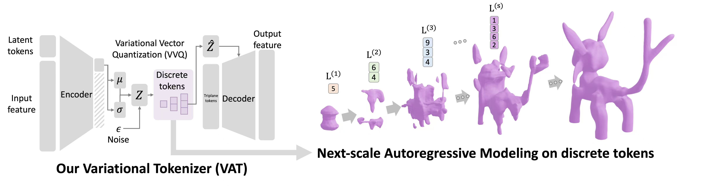
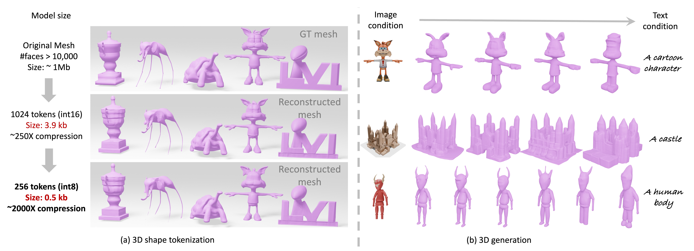

<div align="center">

# 3D representation in 512-Byte: Variational tokenizer is the key for autoregressive 3D generation


<a href='https://arxiv.org/pdf/2412.02202'></a>
<a href='https://sparse-mvs-2.github.io/VAT.IO'></a>



</div>


## Citation

```bibtex
@misc{zhang20243drepresentation512bytevariationaltokenizer,
        title={3D representation in 512-Byte:Variational tokenizer is the key for autoregressive 3D generation}, 
        author={Jinzhi Zhang and Feng Xiong and Mu Xu},
        year={2024},
        eprint={2412.02202},
        archivePrefix={arXiv},
        primaryClass={cs.CV},
        url={https://arxiv.org/abs/2412.02202}, 
  }
```